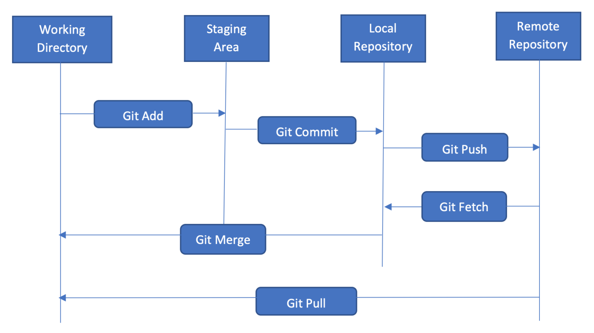
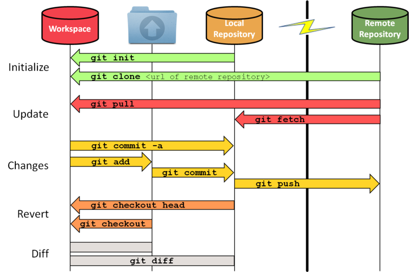
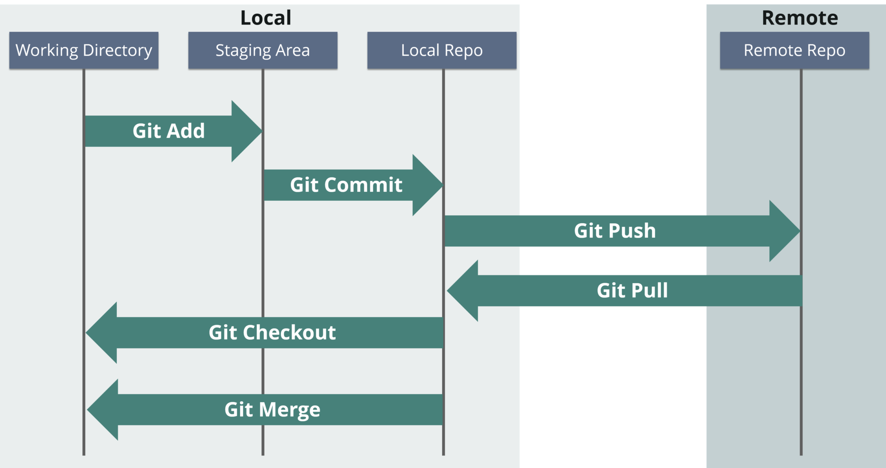

# Heading
## Heading
### Heading
#### Heading
##### Heading
###### Heading

Merhaba markdown

*italic*
_italic_

~~çizgi~~

---
___
üçtane alt çizgi

## Baslık
>Bu bir yazıdır Bu bir yazıdırBu bir yazıdırBu bir yazıdırBu bir yazıdırBu bir yazıdır
> Bu bir yazıdır
> Block olarak yazabilirim

linkler

[Youtube](https://www.youtube.com/watch?v=k_v0cJjktuc)


[test](https://www.youtube.com/watch?v=k_v0cJjktuc "youtube kanalı")

* item 1
* item 2
* item 3
    * item 4
    * item 5
    * item 6

1. item 1
2. item 2
3. item 3

bir ekran görüntüsü koymak istiyoruz projemize veya bir yazımıza, block yazımıza.


kodlarımızı açıklama

```javascript
function add(num1,num2) {
    return num1 + num2;
}```

```bash
npm install
npm start
```
```
normal yazı 
genel olarak kod yazmak için kullanılır
```

| Name | Email |
| ---- | ----- |
| bir ad verelim | birepostaverelim@gmail.com |
| bir ad verelim | birepostaverelim@gmail.com |


* [x] task 1
* [ ] task 2
* [ ] task 3
yaptıkça güncelleyebilirim

git photo ekleme
ilk akış diagramı

ikinci akış diagramı

üçüncü akış diagramı


